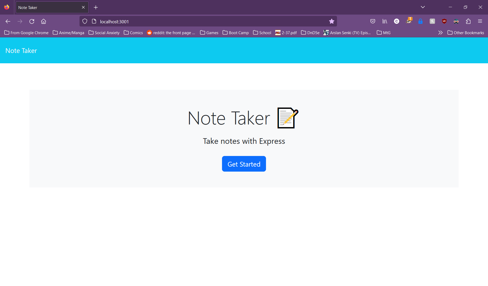

# Note Taker Starter Code

## Description

Good practice using Express.js. A note taking program that allows the user to save and store notes as needed, and introduced me to UUID to help with unique IDs for each entry.

## Table of Contents

If your README is long, add a table of contents to make it easy for users to find what they need.

- [Installation](#installation)
- [Usage](#usage)
- [Credits](#credits)
- [License](#license)

## Installation

If running from terminal, install required packages using 'npm i' and then run 'node server.js' to host locally.

## Usage

Click on the Get Started button to go to the page with notes where stored data sits and the ability to save new notes.

## Credits

Thank you to YouTube channels WebDevSimplified and Sam Meech-Ward